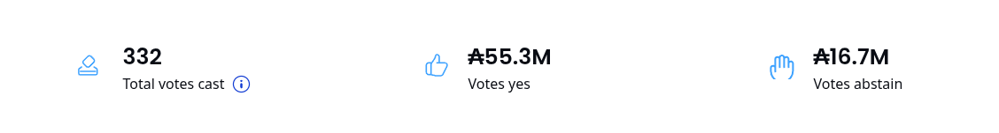

# Introduction

Pairfy is a native Cardano e-commerce dApp funded in the Catalyst F11 round.



Imagine a platform like Amazon or Shopify but governed and operated by its own buyers and sellers as DAO members,
who can vote on key platform decisions and access a shared repository of vendor profiles, product templates, marketing assets, and landing page designs.

On Pairfy, products can be purchased using a Cardano or Midnight wallet. The trading process between the seller and the buyer is handled by Plutus V3 contracts.
Using a Cardano smart-contract allows to use **_ADA_**, **_stablecoin_** and **_native asset_** as a form of payment for the products.
In addition, the implementation of other innovative and deterministic trading logics. It is also compatible with the **_midnight network._**

Pairfy also leverages the collective intelligence of its DAO members to conduct market and product research that benefits the Cardano community.
These features empower any community member to become a seller and launch their own store.

[Pairfy's Website](https://pairfy.io)

[Docs Website](https://docs.pairfy.io)

## Differential factors

- Community-governed with chain vote – DAO constitutional model.
- The **discount liquidity pool** to reduce the price of products.
- Use of Cardano Network – Midnight Network 🔥.
- Free shipping is always included.
- ADA Guarantee as purchase protection.
- Each trade is managed by an isolated smart-contract (Important for high horizontal scalability).
- Any member of the community can be a seller (DAO member).
- Community repository of products, suppliers, marketing, landing pages templates.
- Seller incentive program.
- Integration of AI models, MCP servers.
- Product search by AI vectorized semantics.
- Use of collective intelligence that enables strategic cooperation and mutual benefit for ecosystem members 
(market investigation, supplier analysis, development, innovation, etc).
- Open-source development (Apache 2.0).

#### Open source alternative to

- Amazon
- Shopify
- Dropshipping companies

### Features


| Feature      | yes | Description                                          |
| -------------- | ----- | ------------------------------------------------------ |
| P2P          | ✓  | Cardano  mainnet-preprod        |
| E2E          | ✓  | Signing and sending transactions only in the browser |
| Multi-wallet | ✓  | Lace, Eternl                            |
| Plutus V3       | ✓  | Aiken validators                           |

### Stack


| Stack    | Type      | Description                  | Keywords                     | Version | Licence            | Repository                                                         |
| ---------- | ----------- | ------------------------------ | ------------------------------ | --------- | -------------------- | -------------------------------------------------------------------- |
| mysql    | database  | cloud-native database        | sharding                     | 8.0     | GPL license        | [https://www.mysql.com/downloads](https://www.mysql.com/downloads) |
| Node.js  | runtime   | javascript runtime           | code, javascript             | alpine  | MIT                | [https://github.com/nodejs/node](https://github.com/nodejs/node)   |
| GraphQL  | API       | A GraphQL server can fetch data from separate sources for a single client query | query, polling, websocket | 4.11.2 | MIT | [https://github.com/apollographql/apollo-server](https://github.com/apollographql/apollo-server)

## Road Map

- [X] Add User UI
- [X] Add Seller UI
- [X] Backend
- [X] Multi-Wallet Support
  - [X] Lace
  - [X] Eternl
- [X] Add Blockchain Integration (In Progress)
- [ ] Add Liquidity Pool
- [ ] Add midnight implementation

## Table Of Content

[Installation](#installation)

[Documentation](#documentation)

[License](#license)

### 1\. Installation

Install kubernetes minikube (Linux x86 .deb)

https://minikube.sigs.k8s.io/docs/

```
curl -LO https://storage.googleapis.com/minikube/releases/latest/minikube_latest_amd64.deb
sudo dpkg -i minikube_latest_amd64.deb
```

```
minikube start --driver=docker --cpus="6" --memory=14gb --disk-size=200g 
```

```
minikube addons enable ingress
minikube addons enable dashboard
minikube addons enable metrics-server
```

Clone this repository in the work directory

```
git clone https://github.com/rey-sudo/core.git
```

Install skafold dev
[https://skaffold.dev/docs/install/](https://skaffold.dev/docs/install/)

```
./skaffold.sh
```

Install kubectl

```
https://kubernetes.io/docs/tasks/tools/install-kubectl-linux
```

### 2\. License

This project is licensed under the terms of the [Apache License 2.0](./LICENSE).

Copyright © 2025  
**Pairfy - Juan José Caballero Rey - Cardano Pioneer 1st Cohort**

---

### Contact

- **GitHub:** [rey-sudo](https://github.com/rey-sudo)
- **Email:** [pairfy.dao@gmail.com](mailto:pairfy.dao@gmail.com)  
- **Discord:** [Join our server](https://discord.gg/qEdn9m3VUJ)  
- **X (Twitter):** [@pairfydao](https://x.com/pairfydao)  
- **LinkedIn:** [Rey Sudo](https://www.linkedin.com/in/rey-sudo)

---

### Get Involved

- [Become a Seller](https://seller.pairfy.io)  
- [Become a Mediator](https://discord.gg/qEdn9m3VUJ)  
- [Become an Administrative](https://discord.gg/qEdn9m3VUJ)  
- [Become a Developer](https://discord.gg/qEdn9m3VUJ)  
- [Become a Mod](https://discord.gg/qEdn9m3VUJ)

---

### Video

[](https://www.youtube.com/watch?v=f1lCRxHEJlY)

👉 Prototype RC v1.0.1 mainnet video
